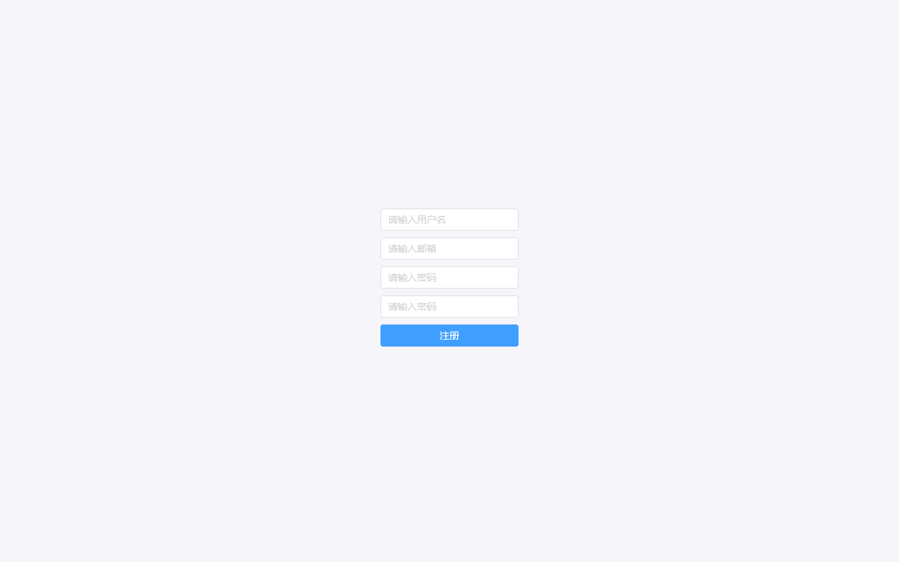
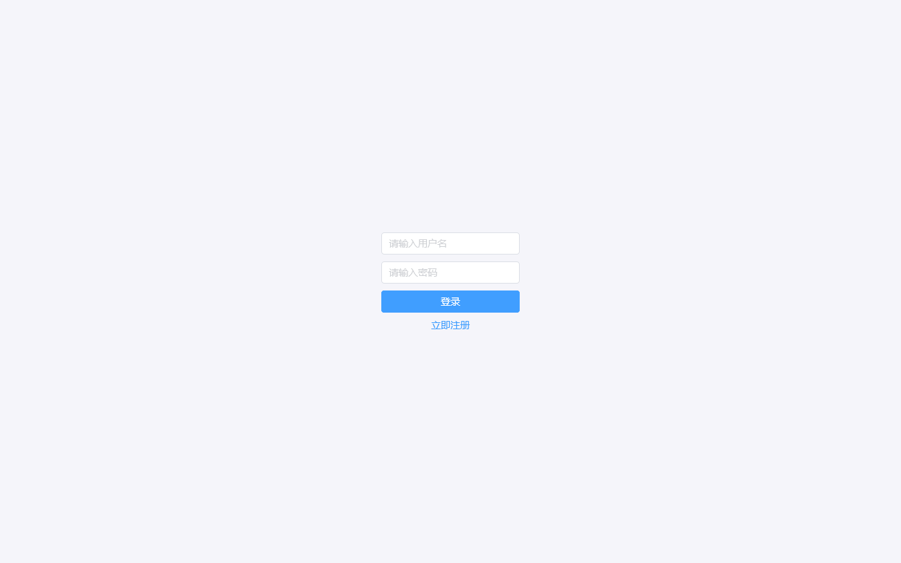
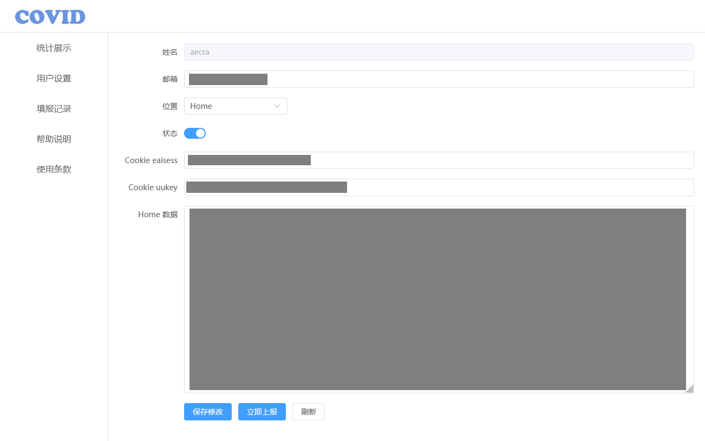
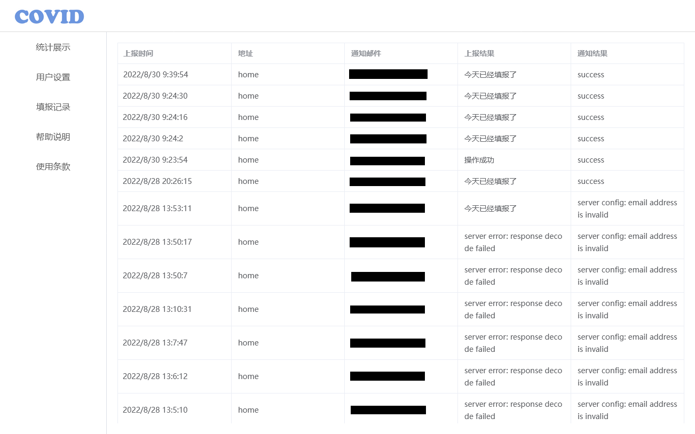

# 疫情填报助手

此项目为西安电子科技大学学生提供友好的疫情信息自行上报功能，可以自行上报疫情信息，并且可以查看自己的上报结果。

## 功能

- 疫情信息自行上报
- 疫情信息上报结果查询
- 邮件通知

## 页面









## 部署

Docker 部署

    ```bash
    docker run -itd --name covid \
      -e DB_DSN="root:password@tcp(host:3306)/covid?parseTime=true" \
      -e EMAIL_ADDR="your email aaddress" \
      -e EMAIL_HOST="smtp server host" \
      -e EMAIL_PASSWORD="" \
      -e EMAIL_PORT="587" \
      -e JWT_SECRET="add your secret" \
      -p 9365:8080 \
      aecra/covid:latest
    ```

## 二次开发

西电采用的是第三方提供的疫情填报系统，在本系统开发中亦发现其他学校使用此系统，如果您使用的系统为同一提供商，可自行修改后端上报地址和默认上报数据，如有问题请与我联系。
